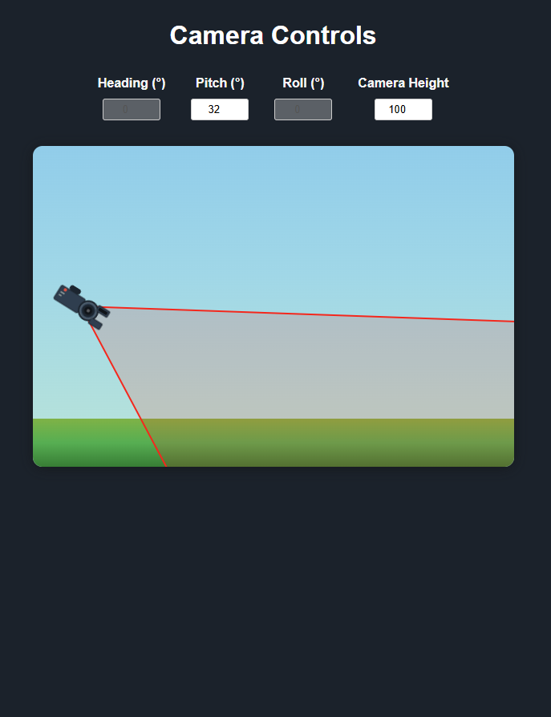

# Camera-Orientation-Demo
User can manipulate the camera's HPR, height and we can see how the final footprint looks like

## Possible roadmap
Use Unity/Godot engine to design the environment.
Write game logic in C#.
Export the game as a WebGL build.
Host it in a Blazor app or embed it in a WPF app using a WebView.

## Work under process
